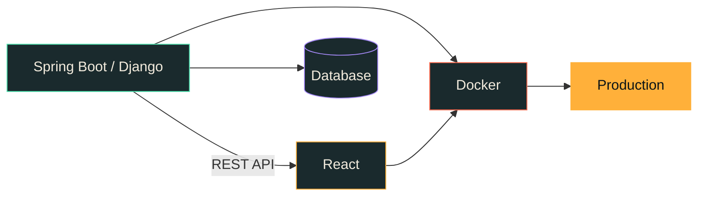

<div align="center">


</div>

---

I build web apps end to end: **APIs in Java and Python**, interfaces in **React**, all packaged in **Docker**. I care about things people actually use — systems for institutions, internal tools, projects that solve someone's real problem.

I also write music with code, in case the backend gets boring.

<div align="center">

[](https://portfolio-phi-ten-37.vercel.app/)
&nbsp;
[](https://www.linkedin.com/in/adalbertocerrillo/)
&nbsp;
[](https://www.youtube.com/@acerrillosoftware)
&nbsp;
[](https://github.com/AdalbertoCerrillo)

</div>

---

## Now

🏭 &nbsp;**[Radii](https://www.radii.com.mx)** · Software Engineer — the part where a drawing becomes a number: instant CNC quoting, vision-based spec extraction from 2D prints, price calibration against real orders, and the Django + React platform underneath. Mostly private code, written up on **[@AdalbertoCerrillo](https://github.com/AdalbertoCerrillo)**.

🚀 &nbsp;**Building two startups** — **StackSelect**, helping students take their first step into the working world · **Moonphase**, from zero. *Creating even the impossible, one step at a time.*

🛠️ &nbsp;**Active contributor** at **[Evodeps](https://github.com/Evodeps)**.

---

## Projects

### ⚡ Featured

| | |
|---|---|
| **[Nocturno 108](https://github.com/AdalbertoCV/nocturno-108)**<br>`Strudel` `Web Audio` `JS` | A jazz-hop track written as code. Audio engine **synthesised from scratch** — no samples, no libraries. Dancing avatar, live piano roll, mixer. |
| **[COSIAP](https://github.com/AdalbertoCV/Sistema-de-Apoyos-COZCyT)**<br>`Django` `Docker` | Grant management for the Zacatecas Science and Technology Council. A real institution, real users. |
| **[Cargas UAIE](https://github.com/AdalbertoCV/Sistema-de-Cargas-UAIE)**<br>`Django` `Docker` `SCSS` | Academic workload distribution across faculty, subjects and terms. |
| **[ETL → Dgraph](https://github.com/AdalbertoCV/ETL-Equipo4)**<br>`Python` `Dgraph` `Luigi` `Dash` | Four heterogeneous formats (CSV, XML, HTM, TXT) consolidated into one graph database, served through an analytics dashboard. |

### 🏗️ Systems & architecture

| | |
|---|---|
| **[SMAM — Pub/Sub](https://github.com/AdalbertoCV/Publica-Suscribe-Equipo4)**<br>`Python` `ActiveMQ` `STOMP` | Vital-sign telemetry fanned out to three independent subscribers. Producers never learn who consumes them. |
| **[Sockets](https://github.com/AdalbertoCV/Sockets)**<br>`Java` `TCP` `Swing` | Chat over raw TCP with file transfer. No framework hiding the handshake; concurrency by hand. |
| **[OOP & Data Structures](https://github.com/AdalbertoCV/POO-EDD)**<br>`Java` `JDBC` `Gradle` | ~340 classes. Lists, stacks, queues, trees, graphs and heaps **built from scratch** — no `Collections`. |

### 🔬 Engineering practice

| | |
|---|---|
| **[Software Testing](https://github.com/AdalbertoCV/Ejercicios_Testing_ENEDIC24)**<br>`Behave` `Selenium` | The full pyramid: doctest → unittest + coverage → BDD → end-to-end on a Django app. |
| **[Personal Software Process](https://github.com/AdalbertoCV/Personal_Software_Process_03)**<br>`Java` `PSP (SEI)` | Five programs with their full process record: estimates, time and defect logs, postmortems. |
| **[Database practice](https://github.com/AdalbertoCV/DBS_Practices)**<br>`Oracle` `PL/SQL` | 31 scripts, four schemas — joins, subqueries, analytic functions, views, transactions. |
| **[Coding challenges](https://github.com/AdalbertoCV/retos_coding)**<br>`Java` | Practice for the problems that show up in technical interviews. |

### 🌐 Web & apps

| | |
|---|---|
| **[Portfolio](https://github.com/AdalbertoCV/Portfolio)** · `React` `Vercel` | My personal portfolio. |
| **[Django frameworks](https://github.com/AdalbertoCV/Frameworks)** · `Django` `MariaDB` | Enrolment system: email activation, custom validators, prerequisite graph, AJAX selects. |
| **[The Code Company](https://github.com/AdalbertoCV/The-Code-Company-Website)** · `Django` `SCSS` | Corporate site, fully admin-managed, with moderated comments. |
| **[Visual .NET](https://github.com/AdalbertoCV/Visual.NET)** · `C#` `ASP.NET Core` | Console → WinForms → MVC with EF Core migrations and Identity. |
| **[Bazar Sol](https://github.com/AdalbertoCV/Bazar_Sol)** · `HTML` `CSS` | An online clothing store. |

### 🔐 Security & data

| | |
|---|---|
| **[CTF writeups](https://github.com/AdalbertoCV/Writeups_picoCTF)** · `picoCTF` `Bandit` | ~160 challenges: web, crypto, forensics, reversing, binary exploitation. The reasoning, not just the flag. |
| **[Stroke prediction](https://github.com/AdalbertoCV/stroke_classification_RF)** · `R` `Random Forest` | ~5% positives, where naive accuracy of 95% detects nothing. Boruta, ROSE, ROC/AUC. |

---

## What I work with

**Languages**


**Backend**


**Frontend**


**Quality**


---

## Where the code goes

Across my repositories, counting programming languages only:

```
Java         ████████████████░░░░░░░░░░░░░░░░░░░░░░░░   41 %   Spring Boot, APIs, algorithms
JavaScript   █████████████░░░░░░░░░░░░░░░░░░░░░░░░░░░   33 %   React and web clients
Python       █████████░░░░░░░░░░░░░░░░░░░░░░░░░░░░░░░   22 %   Django, testing, scripting
C#           █░░░░░░░░░░░░░░░░░░░░░░░░░░░░░░░░░░░░░░░    4 %
```

Beyond that, over half the total volume is **HTML, CSS and SCSS** — the interfaces of those same projects.



---

<div align="center">

**Let's work together?** · [portfolio-phi-ten-37.vercel.app](https://portfolio-phi-ten-37.vercel.app/)


</div>
