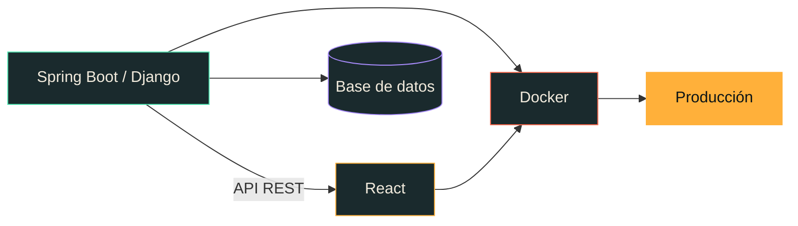

<div align="center">


</div>

---

Construyo aplicaciones web de punta a punta: **APIs en Java y Python**, interfaces en **React**, y todo empaquetado en **Docker**. Me interesan las cosas que se usan de verdad — sistemas para instituciones, herramientas internas, proyectos que resuelven un problema concreto de alguien.

También escribo música con código, por si el backend se pone aburrido.

<div align="center">

[](https://portfolio-phi-ten-37.vercel.app/)
&nbsp;
[](https://github.com/AdalbertoCV?tab=repositories)

</div>

---

## Con qué trabajo

**Lenguajes**


**Backend**


**Frontend**


**Calidad**


---

## Proyectos

| | |
|---|---|
| [**Nocturno 108**](https://github.com/AdalbertoCV/nocturno-108) | Una pista de jazz-hop escrita como código. Strudel para la partitura, y un reproductor con motor de audio sintetizado desde cero en Web Audio: avatar que baila al pulso, piano-roll en vivo y mezcladora. |
| [**COSIAP**](https://github.com/AdalbertoCV/Sistema-de-Apoyos-COZCyT) | Sistema de apoyos del Consejo Zacatecano de Ciencia y Tecnología. Django y Docker, desarrollado en equipo. |
| [**Cargas UAIE**](https://github.com/AdalbertoCV/Sistema-de-Cargas-UAIE) | Gestión de carga de trabajo académica. Django sobre Docker, también en equipo. |
| [**Portfolio**](https://github.com/AdalbertoCV/Portfolio) | Mi portafolio personal en React, desplegado en Vercel. |
| [**Retos de código**](https://github.com/AdalbertoCV/retos_coding) | Práctica en Java de los problemas que salen en entrevistas técnicas. |
| [**Sockets**](https://github.com/AdalbertoCV/Sockets) | Chat básico sobre sockets en Java. Concurrencia y protocolos a mano. |
| [**Bazar Sol**](https://github.com/AdalbertoCV/Bazar_Sol) | Sitio e-commerce de ropa. |

---

## Dónde va el código

Medido sobre mis 22 repositorios (públicos y privados), contando sólo lenguajes de programación:

```
Java         ████████████████░░░░░░░░░░░░░░░░░░░░░░░░   41 %   Spring Boot, APIs, algoritmos
JavaScript   █████████████░░░░░░░░░░░░░░░░░░░░░░░░░░░   33 %   React y clientes web
Python       █████████░░░░░░░░░░░░░░░░░░░░░░░░░░░░░░░   22 %   Django, testing, scripting
C#           █░░░░░░░░░░░░░░░░░░░░░░░░░░░░░░░░░░░░░░░    4 %
```

Aparte, más de la mitad del volumen total es **HTML, CSS y SCSS** — las interfaces de esos mismos proyectos.



---

<div align="center">

**¿Trabajamos juntos?** · [portfolio-phi-ten-37.vercel.app](https://portfolio-phi-ten-37.vercel.app/)


</div>
